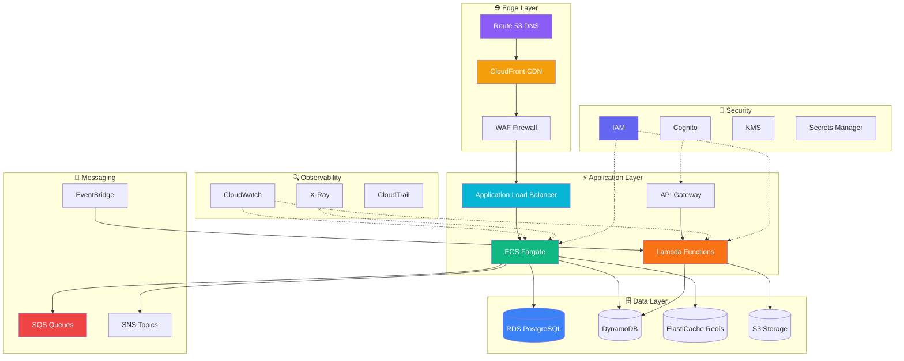
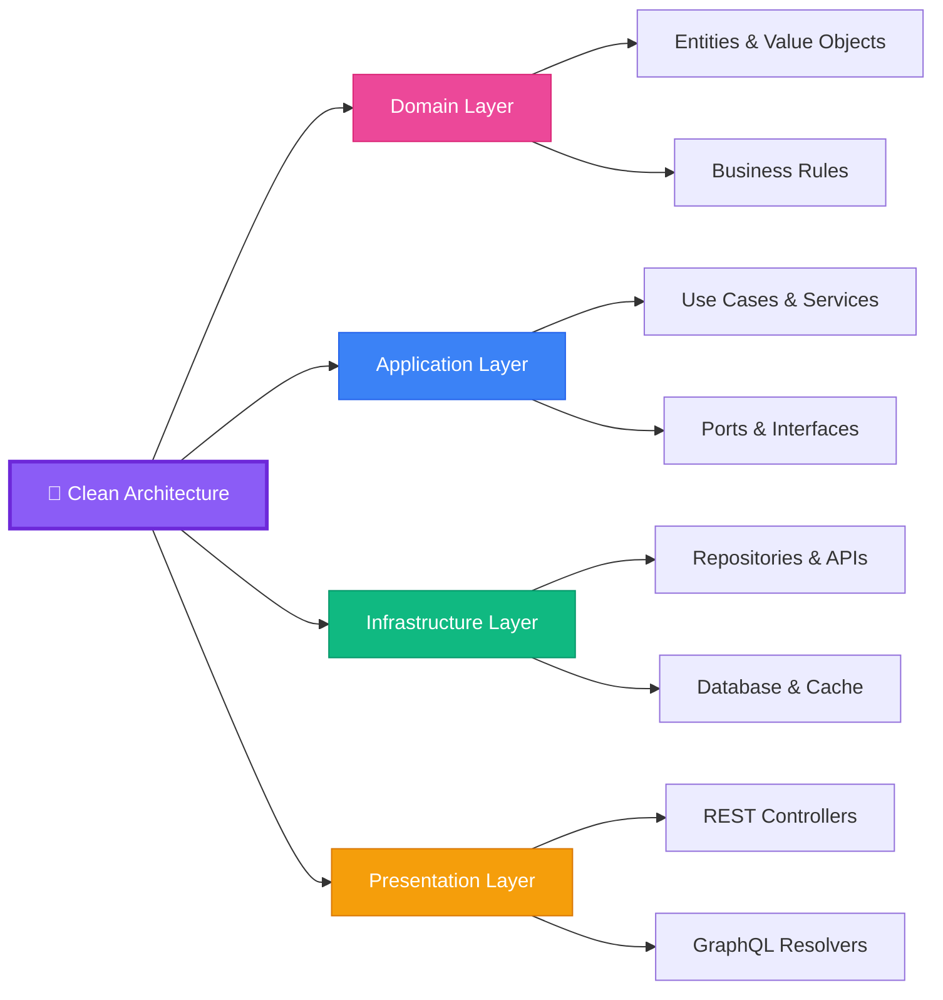
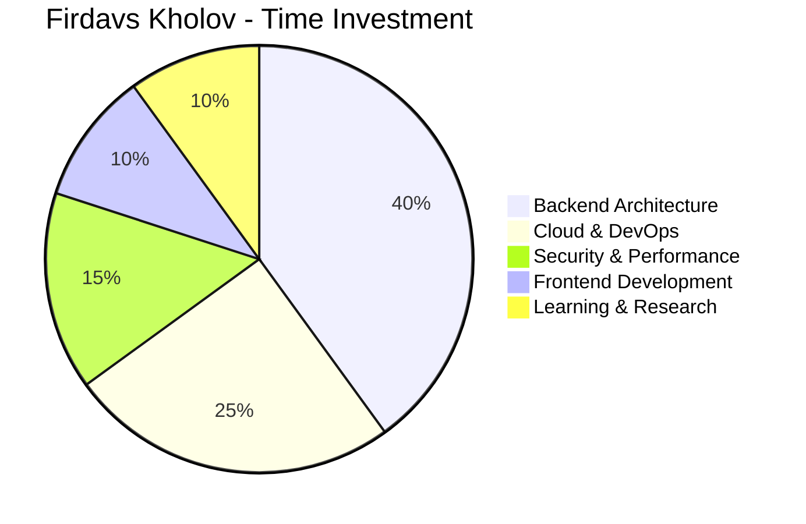

<!--
  ╔══════════════════════════════════════════════════════════════════╗
  ║  Firdavs Kholov | Firdavs Xolov | @firdavs244                 ║
  ║  Backend & Full-Stack Developer from Uzbekistan                ║
  ║  Keywords: Firdavs Kholov, Firdavs Xolov, Firdavs Holov,     ║
  ║  Backend Developer Uzbekistan, Python Django Laravel AWS       ║
  ║  Full-Stack Developer, Software Engineer Uzbekistan            ║
  ╚══════════════════════════════════════════════════════════════════╝
-->

<!-- STRUCTURED DATA FOR SEO -->
<!--
{
  "@context": "https://schema.org",
  "@type": "Person",
  "name": "Firdavs Kholov",
  "alternateName": ["Firdavs Xolov", "Firdavs Holov", "firdavs244"],
  "jobTitle": "Backend & Full-Stack Developer",
  "url": "https://github.com/firdavs244",
  "address": {
    "@type": "PostalAddress",
    "addressCountry": "Uzbekistan"
  },
  "knowsAbout": ["Python", "Django", "FastAPI", "Laravel", "AWS", "Docker", "Kubernetes", "PostgreSQL", "Microservices"],
  "sameAs": [
    "https://github.com/firdavs244",
    "https://linkedin.com/in/firdavs-kholov",
    "https://t.me/firdavs_kholov"
  ]
}
-->


<div align="center">

[;Backend+Architect+%7C+Cloud+Engineer+%7C+Problem+Solver;Building+Scalable+%26+Secure+Systems+%F0%9F%9A%80)](https://github.com/firdavs244)

</div>

<!-- ═══════════════════ SOCIAL & PROFILE BADGES ═══════════════════ -->

<div align="center">

[](https://github.com/firdavs244)
[](https://github.com/firdavs244?tab=followers)
[](https://github.com/firdavs244)

</div>

<div align="center">

[](https://linkedin.com/in/firdavs-kholov)
[](https://t.me/firdavs_kholov)
[](mailto:firdavskholov@gmail.com)
[](https://firdavskholov.dev)

</div>

<br>


<!-- ═══════════════════ ABOUT FIRDAVS KHOLOV ═══════════════════ -->

##  **About Firdavs Kholov**

> **Firdavs Kholov** (also known as **Firdavs Xolov**) is a passionate **Backend & Full-Stack Developer** from **Uzbekistan** 🇺🇿 specializing in building **scalable, secure, and high-performance** applications. With deep expertise in **Python (Django, FastAPI)**, **PHP (Laravel)**, and **AWS Cloud**, Firdavs designs **production-grade microservice architectures** that power real-world systems.

<table align="center">
<tr>
<td width="50%">

```python
# 👨‍💻 firdavs_kholov.py

class FirdavsKholov:
    """
    Backend & Full-Stack Developer
    Also known as: Firdavs Xolov
    """
    
    def __init__(self):
        self.name = "Firdavs Kholov"
        self.username = "firdavs244"
        self.location = "Uzbekistan 🇺🇿"
        self.current_role = "Backend Architect"
        
        self.languages = {
            "proficient": ["Python", "PHP", "JavaScript"],
            "learning": ["Go", "TypeScript"]
        }
        
        self.backend = {
            "python": ["Django", "DRF", "FastAPI"],
            "php": ["Laravel", "Lumen"],
            "api": ["REST", "GraphQL", "gRPC"]
        }
        
        self.cloud = {
            "aws": [
                "EC2", "S3", "RDS", "Lambda",
                "DynamoDB", "SQS", "SNS",
                "API Gateway", "CloudWatch"
            ]
        }
        
        self.devops = [
            "Docker", "Kubernetes", "Helm",
            "GitHub Actions", "Jenkins",
            "Nginx", "Linux"
        ]
        
        self.architecture = [
            "Microservices", "Event-Driven",
            "Clean Architecture", "DDD",
            "CQRS", "SOLID"
        ]
    
    def say_hi(self):
        return "Let's build something amazing! 🚀"


me = FirdavsKholov()
print(me.say_hi())
```

</td>
<td width="50%">

<div align="center">

### 🎯 **What Firdavs Kholov Does Best**

<br>

🏗️ **System Architecture**
> Designing microservice & event-driven architectures for scale

🔒 **Security Engineering**  
> OAuth2, JWT, Zero Trust, encryption at rest & in transit

⚡ **Performance Optimization**
> Database tuning, caching strategies, async processing

☁️ **Cloud Infrastructure**
> AWS-native solutions, IaC, containerized deployments

🔄 **API Development**
> RESTful, GraphQL, gRPC — clean, versioned, documented

📊 **Observability**
> Monitoring, logging, distributed tracing, alerting

<br>

```
🟢 Available for Hire
🟢 Open to Collaboration
🟢 Open Source Contributor
```

</div>

</td>
</tr>
</table>


<!-- ═══════════════════ TECH STACK ═══════════════════ -->

## 🛠️ **Technology Stack**

<div align="center">

### **Languages & Frameworks**

<a href="https://github.com/firdavs244">
  
</a>

### **Databases & Caching**

<a href="https://github.com/firdavs244">
  
</a>

### **DevOps & Cloud Infrastructure**

<a href="https://github.com/firdavs244">
  
</a>

### **Tools & Platforms**

<a href="https://github.com/firdavs244">
  
</a>

</div>


<!-- ═══════════════════ AWS CLOUD ═══════════════════ -->

## ☁️ **AWS Cloud Expertise**

<div align="center">


</div>

<details open>
<summary><b>🏗️ Production Architecture by Firdavs Kholov</b></summary>
<br>


```mermaid
graph TB
    subgraph "🌐 Edge Layer"
        R53[Route 53 DNS]
        CF[CloudFront CDN]
        WAF[WAF Firewall]
    end

    subgraph "⚡ Application Layer"
        APIGW[API Gateway]
        ALB[Application Load Balancer]
        ECS[ECS Fargate]
        LAMBDA[Lambda Functions]
    end

    subgraph "🗄️ Data Layer"
        RDS[(RDS PostgreSQL)]
        DYNAMO[(DynamoDB)]
        ELASTIC[(ElastiCache Redis)]
        S3[(S3 Storage)]
    end

    subgraph "📨 Messaging"
        SQS[SQS Queues]
        SNS[SNS Topics]
        EB[EventBridge]
    end

    subgraph "🔍 Observability"
        CW[CloudWatch]
        XRAY[X-Ray]
        CT[CloudTrail]
    end

    subgraph "🔐 Security"
        IAM[IAM]
        COG[Cognito]
        KMS[KMS]
        SM[Secrets Manager]
    end

    R53 --> CF --> WAF --> ALB
    APIGW --> LAMBDA
    ALB --> ECS
    ECS --> RDS & DYNAMO & ELASTIC
    ECS --> SQS & SNS
    LAMBDA --> S3 & DYNAMO
    EB --> LAMBDA
    CW -.-> ECS & LAMBDA
    XRAY -.-> ECS
    IAM -.-> ECS & LAMBDA
    COG -.-> APIGW

    style R53 fill:#8b5cf6,color:#fff
    style CF fill:#f59e0b,color:#fff
    style ALB fill:#06b6d4,color:#fff
    style ECS fill:#10b981,color:#fff
    style RDS fill:#3b82f6,color:#fff
    style LAMBDA fill:#f97316,color:#fff
    style SQS fill:#ef4444,color:#fff
    style IAM fill:#6366f1,color:#fff
```

</details>

<div align="center">

| Category | AWS Services |
|:--------:|:------------:|
| **🖥️ Compute** |     |
| **💾 Storage & DB** |     |
| **🌐 Networking** |    |
| **📨 Messaging** |     |
| **🔐 Security** |     |
| **🔍 Monitoring** |    |
| **🛠️ Dev Tools** |     |

</div>


<!-- ═══════════════════ ARCHITECTURE ═══════════════════ -->

## 🏛️ **Architectural Philosophy**

<div align="center">


```mermaid
graph LR
    A[🎯 Clean Architecture] --> B[Domain Layer]
    A --> C[Application Layer]
    A --> D[Infrastructure Layer]
    A --> E[Presentation Layer]

    B --> B1[Entities & Value Objects]
    B --> B2[Business Rules]
    
    C --> C1[Use Cases & Services]
    C --> C2[Ports & Interfaces]
    
    D --> D1[Repositories & APIs]
    D --> D2[Database & Cache]
    
    E --> E1[REST Controllers]
    E --> E2[GraphQL Resolvers]

    style A fill:#8b5cf6,stroke:#6d28d9,stroke-width:3px,color:#fff
    style B fill:#ec4899,stroke:#db2777,color:#fff
    style C fill:#3b82f6,stroke:#2563eb,color:#fff
    style D fill:#10b981,stroke:#059669,color:#fff
    style E fill:#f59e0b,stroke:#d97706,color:#fff
```

</div>

<table align="center">
<tr>
<td width="25%" align="center">

### 🧩 DDD
**Domain-Driven Design**

Rich domain models, bounded contexts, ubiquitous language

</td>
<td width="25%" align="center">

### 🏛️ Clean Code
**Clean Architecture**

Dependency inversion, testable & maintainable systems

</td>
<td width="25%" align="center">

### 🔧 SOLID
**Design Principles**

SRP, OCP, LSP, ISP, DIP — every single day

</td>
<td width="25%" align="center">

### 🎨 Patterns
**Design Patterns**

Repository, Factory, Strategy, Observer, Decorator

</td>
</tr>
</table>


<!-- ═══════════════════ GITHUB STATS ═══════════════════ -->

## 📊 **GitHub Analytics**

<!-- GitHub Profile Trophies -->
<div align="center">

[](https://github.com/firdavs244)

</div>

<br>

<div align="center">
<table>
<tr>
<td width="50%">


</td>
<td width="50%">


</td>
</tr>
</table>
</div>

<div align="center">

[](https://git.io/streak-stats)

</div>

<br>

<!-- Activity Graph -->
<div align="center">

[](https://github.com/firdavs244)

</div>

<br>

<!-- Profile Summary Cards -->
<div align="center">

[](https://github.com/firdavs244)

<table>
<tr>
<td>

[](https://github.com/firdavs244)

</td>
<td>

[](https://github.com/firdavs244)

</td>
</tr>
<tr>
<td>

[](https://github.com/firdavs244)

</td>
<td>

[](https://github.com/firdavs244)

</td>
</tr>
</table>

</div>


<!-- ═══════════════════ SNAKE ANIMATION ═══════════════════ -->

## 🐍 **Contribution Snake**

<div align="center">

<picture>
  <source media="(prefers-color-scheme: dark)" srcset="https://raw.githubusercontent.com/firdavs244/firdavs244/output/github-snake-dark.svg" />
  <source media="(prefers-color-scheme: light)" srcset="https://raw.githubusercontent.com/firdavs244/firdavs244/output/github-snake.svg" />
  
</picture>

</div>


<!-- ═══════════════════ LEARNING JOURNEY ═══════════════════ -->

## 🎯 **Current Focus & Goals**

<table align="center">
<tr>
<td width="50%">

### 🚀 **2026-2027 Roadmap**

```yaml
# firdavs_kholov_roadmap.yml

mastering:
  architecture:
    - "🏗️ Advanced Microservices Patterns"
    - "🌊 Event-Driven Architecture (Kafka)"
    - "🔄 CQRS & Event Sourcing"
    - "🛡️ Zero-Trust Security Models"

  cloud_native:
    - "☁️ Serverless-First Architecture"
    - "🔧 Terraform & Infrastructure as Code"
    - "📊 Observability Stack (Grafana/Prometheus)"
    - "🕸️ Service Mesh (Istio)"

  certifications:
    - "🏆 AWS Solutions Architect (In Progress)"
    - "🎓 CKA - Kubernetes Administrator"

  personal:
    - "📖 Contributing to Open Source"
    - "🌎 Improving English Proficiency"
    - "✍️ Technical Blog Writing"
```

</td>
<td width="50%">

### 📊 **Expertise Distribution**


```mermaid
pie title Firdavs Kholov - Time Investment
    "Backend Architecture" : 40
    "Cloud & DevOps" : 25
    "Security & Performance" : 15
    "Frontend Development" : 10
    "Learning & Research" : 10
```

### 🏅 **Quick Facts**

| | |
|:--|:--|
| 🔭 | Working on **production microservices** |
| 🌱 | Learning **Go** and **System Design** |
| 👯 | Open to **collaborate** on backend projects |
| 💬 | Ask me about **Django, Laravel, AWS, Docker** |
| ⚡ | Fun fact: I debug in my dreams 🛌💻 |

</td>
</tr>
</table>


<!-- ═══════════════════ CONNECT ═══════════════════ -->

## 🤝 **Connect with Firdavs Kholov**

<div align="center">

### **Let's build something amazing together! 🚀**

<br>

<a href="https://linkedin.com/in/firdavs-kholov" target="_blank">
  
</a>
<a href="https://t.me/firdavs_kholov" target="_blank">
  
</a>
<a href="mailto:firdavskholov@gmail.com">
  
</a>

<br><br>

<a href="https://github.com/firdavs244" target="_blank">
  
</a>
<a href="https://dev.to/firdavs244" target="_blank">
  
</a>
<a href="https://stackoverflow.com/users/firdavs-kholov" target="_blank">
  
</a>

</div>

<br>

<div align="center">

### 💫 **Always open for:**

<table>
<tr>
<td align="center" width="25%">

**🚀**<br>
**Exciting Projects**<br>
<sub>Scalable apps with modern architecture</sub>

</td>
<td align="center" width="25%">

**🤝**<br>
**Collaborations**<br>
<sub>Open source & partnerships</sub>

</td>
<td align="center" width="25%">

**💡**<br>
**Knowledge Sharing**<br>
<sub>Mentoring & tech talks</sub>

</td>
<td align="center" width="25%">

**🌱**<br>
**Innovation**<br>
<sub>Cutting-edge technologies</sub>

</td>
</tr>
</table>

</div>


<div align="center">

### 💭 *"Code is poetry, architecture is art, and every system is a story waiting to be told."*
#### — **Firdavs Kholov**

<br>

<!-- Random Dev Quote -->
[](https://github.com/firdavs244)

</div>

<br>


<!-- 
  SEO KEYWORDS (for search engine indexing):
  Firdavs Kholov, Firdavs Xolov, Firdavs Holov, firdavs244,
  Backend Developer Uzbekistan, Full-Stack Developer Uzbekistan,
  Python Developer, Django Developer, Laravel Developer,
  AWS Cloud Engineer, DevOps Engineer, Software Engineer,
  Firdavs Kholov GitHub, Firdavs Xolov GitHub,
  Firdavs Kholov Portfolio, Firdavs Kholov Developer
-->
