# 👋 Hi there! I'm **Firdavs Kholov**

<div align="center">
  
[](https://git.io/typing-svg)

</div>

<div align="center">
  
  
</div>

---

## 🚀 **About Me**

```typescript
const firdavs: Developer = {
  name: "Firdavs Kholov",
  role: "Backend & Full-Stack Developer",
  location: "🌍 Remote",
  passion: ["Clean Code", "Scalable Architecture", "Innovation"],
  currentFocus: [
    "🏗️ Microservices Architecture",
    "☁️ Cloud-Native Applications", 
    "🔄 DevOps & CI/CD Automation",
    "🧠 System Design Patterns"
  ],
  motto: "Code is more than technology — it's a way of thinking 💭"
};
```

<div align="center">

### 🎯 **Core Expertise**

</div>

<table align="center">
<tr>
<td align="center" width="33%">

**🏗️ Backend Architecture**
<br>
Building robust, scalable APIs and microservices with clean architecture principles

</td>
<td align="center" width="33%">

**☁️ Cloud & DevOps**
<br>
Deploying and managing applications on AWS with Docker, Kubernetes, and CI/CD

</td>
<td align="center" width="33%">

**🔒 Security & Performance**
<br>
Implementing secure authentication, optimization, and monitoring solutions

</td>
</tr>
</table>

---

## 🛠️ **Tech Arsenal**

<div align="center">

### **💻 Frontend**


### **🧠 Backend**


### **🗄️ Databases**


### **⚙️ DevOps & Tools**


</div>

---

## 🏗️ **AWS Services I Work With**

<div align="center">

<table>
<tr>
<td align="center"><strong>🖥️ Compute</strong></td>
<td align="center"><strong>💾 Storage & Databases</strong></td>
<td align="center"><strong>🌐 Networking & APIs</strong></td>
</tr>
<tr>
<td align="center">
  
  
  <br>
  
</td>
<td align="center">
  
  
  <br>
  
  
</td>
<td align="center">
  
  <br>
  
  <br>
  
</td>
</tr>
</table>

</div>

---

## 🧠 **Architecture & Design Patterns**

```mermaid
graph LR
    A[🏗️ Clean Architecture] --> B[Domain-Driven Design]
    A --> C[SOLID Principles]
    A --> D[Design Patterns]
    
    B --> B1[Entities & Aggregates]
    B --> B2[Value Objects]
    B --> B3[Repositories]
    
    C --> C1[Single Responsibility]
    C --> C2[Open/Closed]
    C --> C3[Dependency Inversion]
    
    D --> D1[Factory Pattern]
    D --> D2[Repository Pattern]
    D --> D3[Strategy Pattern]
    D --> D4[Observer Pattern]
    
    style A fill:#6366f1,stroke:#4f46e5,stroke-width:3px,color:#fff
    style B fill:#8b5cf6,stroke:#7c3aed,stroke-width:2px,color:#fff
    style C fill:#06b6d4,stroke:#0891b2,stroke-width:2px,color:#fff
    style D fill:#10b981,stroke:#059669,stroke-width:2px,color:#fff
```

<div align="center">



</div>

<div align="center">

### **🎯 Design Philosophy**

| **Principle** | **Implementation** |
|:-------------:|:-------------------|
| 🧩 **Domain-Driven Design** | Building business-oriented applications with clear bounded contexts and rich domain models |
| 🏛️ **Clean Architecture** | Separating concerns with dependency inversion and testable, maintainable code structures |
| 🔧 **SOLID Principles** | Writing flexible, extensible code that's easy to modify and understand |
| 🎨 **Design Patterns** | Applying proven solutions like Repository, Factory, Strategy, and Observer patterns |

</div>

---

## 📊 **GitHub Analytics**

<div align="center">


</div>

<div align="center">

[](https://git.io/streak-stats)

</div>

---

## 🎯 **Current Focus Areas**

<div align="center">

```yaml
learning_path:
  current_goals:
    - "🏗️ Mastering Microservices Architecture"
    - "☁️ Advanced Cloud-Native Development"
    - "🔄 Perfecting CI/CD Automation"
    - "🧪 Test-Driven Development"
  
  technologies_exploring:
    - "🦀 Rust for Systems Programming"
    - "⚡ Event-Driven Architecture"
    - "🔒 Zero-Trust Security Models"
    - "📊 Observability & Monitoring"
  
  interests:
    - "🌟 Open Source Contributions"
    - "📝 Technical Writing & Blogging"
    - "🎤 Tech Community Speaking"
```

</div>

---

## 🤝 **Let's Connect & Collaborate**

<div align="center">

### **💬 Always Open To:**
**🚀 Exciting Projects** • **🤝 Collaborations** • **💡 Knowledge Sharing** • **🌱 Mentoring**

<br>

[](mailto:your.email@example.com)
[](https://linkedin.com/in/firdavskholov)
[](https://twitter.com/firdavskholov)
[](https://firdavskholov.dev)

</div>

---

<div align="center">

### **🎨 "Building the future, one commit at a time"**


</div>
