# 🚀 Welcome to My Digital Universe

<div align="center">

[](https://git.io/typing-svg)

</div>

<div align="center">
  
  
  
  
</div>


## 🌟 About Me

<table align="center">
<tr>
<td width="50%">

```typescript
interface Developer {
  name: string;
  role: string[];
  location: string;
  passion: string[];
  architecture: string[];
  motto: string;
}

const firdavs: Developer = {
  name: "Firdavs Kholov",
  role: [
    "🎯 Backend Architect",
    "🌐 Full-Stack Developer", 
    "☁️ Cloud Engineer",
    "🔧 DevOps Enthusiast"
  ],
  location: "🇺🇿 Uzbekistan",
  passion: [
    "Clean Architecture",
    "Scalable Systems", 
    "Innovation & Learning"
  ],
  architecture: [
    "🏗️ Microservices",
    "🔄 Event-Driven",
    "🛡️ Security-First",
    "📊 Observable Systems"
  ],
  motto: "Code is poetry in motion 🎭"
};
```

</td>
<td width="50%">

<div align="center">

### 🎯 **Core Expertise**

```mermaid
mindmap
  root((🚀 Firdavs))
    Backend
      🏗️ Architecture
      🔒 Security
      📊 Performance
      🔄 APIs
    Cloud
      ☁️ AWS
      🐳 Docker  
      ⚙️ K8s
      🔧 DevOps
    Frontend
      ⚛️ React
    Database
      🗄️ SQL/NoSQL
      🔍 Optimization
      📈 Scaling
      💾 Caching
```



</div>

</td>
</tr>
</table>


## 🛠️ **Technology Ecosystem**

<details open>
<summary><b>🎨 Frontend Technologies</b></summary>
<br>

<div align="center">

| **Core** | **Frameworks** | **Styling** |
|:--------:|:--------------:|:-----------:|
|  |  |  |
|  |  |

</div>

</details>

<details open>
<summary><b>🧠 Backend Powerhouse</b></summary>
<br>

<div align="center">

### **🐍 Python Ecosystem**


### **🐘 PHP Ecosystem**  


</div>

</details>

<details open>
<summary><b>🗄️ Data Management</b></summary>
<br>

<div align="center">

| **Relational** | **NoSQL** | **Caching** |
|:--------------:|:---------:|:-----------:|
|  |  |  |
|  |  |
|  | |

</div>

</details>

<details open>
<summary><b>⚙️ DevOps & Infrastructure</b></summary>
<br>

<div align="center">

### **🐳 Containerization & Orchestration**


### **🔄 CI/CD & Version Control**


### **🌐 Web Servers & Networking**


### **🐧 Operating Systems**


</div>

</details>


## ☁️ **AWS Cloud Mastery**

<div align="center">


</div>

<details open>
<summary><b>🏗️ My AWS Architecture</b></summary>



</details>


```mermaid
graph TD
    subgraph "🌐 Frontend Layer"
        CF[CloudFront CDN]
        S3[S3 Static Hosting]
    end
    
    subgraph "⚡ Application Layer"
        ALB[Application Load Balancer]
        EC2[EC2 Instances]
        EBS[Elastic Beanstalk]
        LAMBDA[Lambda Functions]
    end
    
    subgraph "🗄️ Data Layer" 
        RDS[(RDS Database)]
        DYNAMO[(DynamoDB)]
        REDIS[(ElastiCache Redis)]
        S3DATA[S3 Data Storage]
    end
    
    subgraph "🔒 Security & Monitoring"
        IAM[IAM Roles & Policies]
        KMS[KMS Encryption]
        CW[CloudWatch]
        XRAY[X-Ray Tracing]
    end
    
    subgraph "📨 Communication"
        SQS[SQS Queues]
        SNS[SNS Topics] 
        KINESIS[Kinesis Streams]
        APIGW[API Gateway]
    end
    
    CF --> ALB
    S3 --> CF
    ALB --> EC2
    ALB --> EBS
    APIGW --> LAMBDA
    EC2 --> RDS
    EC2 --> DYNAMO
    EC2 --> REDIS
    LAMBDA --> S3DATA
    
    style CF fill:#ff6b6b
    style ALB fill:#4ecdc4  
    style RDS fill:#45b7d1
    style LAMBDA fill:#f9ca24
    style IAM fill:#6c5ce7
```

| Category                | Services                                                                                           |
|------------------------|----------------------------------------------------------------------------------------------------|
| 🖥️ **Compute**         |   |
| 💾 **Storage & DBs**   |     |
| 🌠**Networking & APIs**|    |
| 🧱 **Infra as Code**   |  |
| 🔔 **Messaging & Events** |    |
| 🔠**Security & IAM**  |     |
| 🔠**Monitoring & Logging** |    |
| 🛠️ **Dev Tools**       |    |


## 🏗️ **Architectural Philosophy**

```mermaid
graph LR
    A[🎯 Clean Architecture] --> B[Domain Layer]
    A --> C[Application Layer] 
    A --> D[Infrastructure Layer]
    A --> E[Presentation Layer]
    
    B --> B1[🧩 Entities]
    B --> B2[🎭 Value Objects]
    B --> B3[📋 Business Rules]
    
    C --> C1[⚙️ Use Cases]
    C --> C2[🔧 Services]
    C --> C3[🚪 Interfaces]
    
    D --> D1[🗄️ Repositories]
    D --> D2[🌐 External APIs]
    D --> D3[💾 Database]
    
    E --> E1[🖥️ Controllers]
    E --> E2[📡 API Endpoints]
    E --> E3[🎨 UI Components]
    
    style A fill:#667eea,stroke:#764ba2,stroke-width:4px,color:#fff
    style B fill:#f093fb,stroke:#f5576c,stroke-width:2px,color:#fff
    style C fill:#4facfe,stroke:#00f2fe,stroke-width:2px,color:#fff
    style D fill:#43e97b,stroke:#38f9d7,stroke-width:2px,color:#fff
    style E fill:#ffecd2,stroke:#fcb69f,stroke-width:2px,color:#000
```

<div align="center">



</div>

### **🎨 Design Principles**

<table align="center">
<tr>
<td width="25%" align="center">

**🧩 Domain-Driven Design**
<br><br>
Building business-centric applications with rich domain models and clear bounded contexts

</td>
<td width="25%" align="center">

**🏛️ Clean Architecture**
<br><br>
Dependency inversion and separation of concerns for maintainable, testable systems

</td>
<td width="25%" align="center">

**🔧 SOLID Principles**
<br><br>
Writing flexible, extensible code following industry best practices

</td>
<td width="25%" align="center">

**🎯 Design Patterns**
<br><br>
Repository, Factory, Strategy, Observer, and Decorator patterns implementation

</td>
</tr>
</table>


## 📊 **Performance Dashboard**

<div align="center">

<table>
<tr>
<td>


</td>
<td>


</td>
</tr>
</table>

</div>

<div align="center">

[](https://git.io/streak-stats)

</div>

<div align="center">

### **🏆 Achievements & Contributions**


</div>


## 🎯 **Current Learning Journey**

<div align="center">

<table>
<tr>
<td width="50%">

### **🚀 Focus Areas 2024**

```yaml
current_mastery:
  architecture:
    - "🏗️ Microservices Design Patterns"
    - "🌊 Event-Driven Architecture"
    - "🔄 CQRS & Event Sourcing"
    - "🛡️ Zero-Trust Security Models"
  
  cloud_native:
    - "☁️ Serverless Architecture"
    - "📊 Observability & Monitoring"
    - "🚀 GitOps & Infrastructure as Code"
    - "🔧 Service Mesh (Istio)"
  
  emerging_tech:
    - "📦 Advanced DevOps & IaC (Terraform, Ansible, GitOps)"
    - "📡 API Gateway & Service Mesh (Nginx, Istio)"
    - "🛡️ Security Practices (OAuth2, JWT, Zero Trust)"
    - "📈 Distributed Tracing & Observability (Grafana, Prometheus)"
    - "🌩️ AWS Advanced Services (EventBridge, Step Functions)"
```

</td>
<td width="50%">

### **📚 Learning Progress**


**🎯 Current Goals:**
- 🏆 AWS Solutions Architect Certification
- 🎓 CKA (Certified Kubernetes Administrator) 😁
- 📖 Contributing to Open Source Projects
- 🌎 Improving English Proficiency

</td>
</tr>
</table>

</div>


## 🌟 **Let's Build Something Amazing Together**

<div align="center">

### **💫 Always Open For:**

<table>
<tr>
<td align="center" width="25%">

**🚀**
<br>
**Exciting Projects**
<br>
*Scalable applications with modern architecture*

</td>
<td align="center" width="25%">

**🤝**
<br>
**Collaborations**
<br>
*Open source contributions and partnerships*

</td>
<td align="center" width="25%">

**💡**
<br>
**Knowledge Sharing**
<br>
*Tech talks, mentoring, and workshops*

</td>
<td align="center" width="25%">

**🌱**
<br>
**Innovation**
<br>
*Exploring cutting-edge technologies*

</td>
</tr>
</table>

</div>


<div align="center">

### **🎭 "Code is more than just technology — it's a way of thinking, architecture is art, and innovation is the canvas"**


